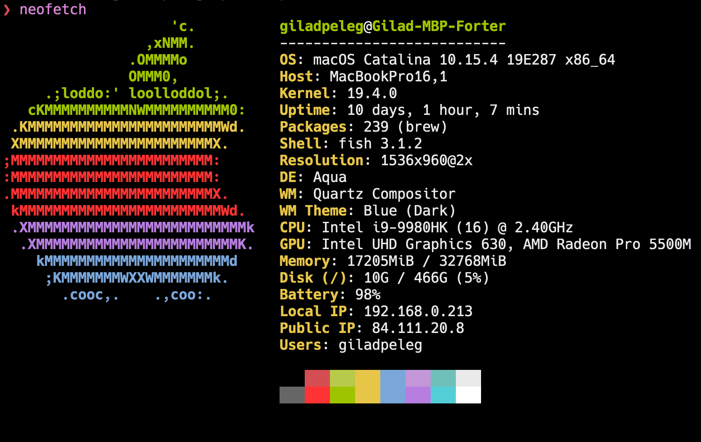

# My configuration files for macOS
> Fish, Tmux, Karabiner, Hammerspoon, Vim, Brew, NPX, Dotbot

[](https://github.com/pgilad/dotfiles/actions)



## My dotfiles have aged, they're now `v2` !!!

My dotfiles have been completely revamped on 27/10/2019.
[Click here for my v1 dotfiles](https://github.com/pgilad/dotfiles/tree/v1)

It is said that "You cannot clone the same dotfiles twice" - [Wiki](https://en.wikiquote.org/wiki/Heraclitus#Quotes).

## Installation

```sh
$ git clone --recurse-submodules https://github.com/pgilad/dotfiles.git ~/.dotfiles

$ ~/.dotfiles/install.sh
```

## Todo

- How does it install on a new mac?

## License

MIT © [Gilad Peleg](https://www.giladpeleg.com)
